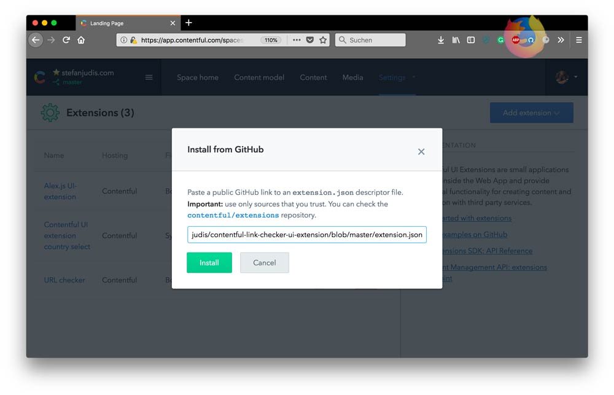
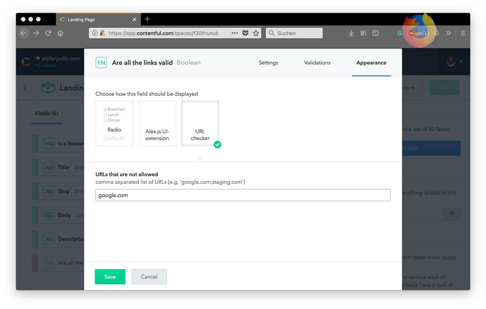

# Contentful URL checker UI extension

A Contentful UI-extension that gets all string values of an entry, gets the included URLs and makes actual requests to see if the URL responds with a `200` status code.

## How it works

The UI extension will access all string values of the entry and evaluate what URLs are included. Then it will make actual requests to the found URLs and check if the returned status code is `200`. If now the URLs is marked as invalid.

Additionally the extension makes use of parameters which makes it possible to black-list certain URLs to prevent e.g. linking to a testing or staging environment.

## How to install

Currently there are two way to install a UI-extension.

### Installation via the web app

- go to the extensions section in the web app
- click `Add extension`
- click `Instal from GitHub`
- paste `https://github.com/stefanjudis/contentful-link-checker-ui-extension/blob/master/extension.json` into the input field
- done ✅

### Installation via the command line

- clone the repository
- run `npm install` in the cloned directory
- run `npm run create`
- done ✅

The repository has the [Contentful CLI](https://github.com/contentful/contentful-cli/) as a local dependency so that you don't have install it globally.

## How to enable the extension

To enable the extension go to a content type of your choice and add a new field of type `Boolean`. In the appearance panel you can then find the `URL checker`. There you can also define the URLs (a simple string match is performed) that should be marked as invalid, too.

*Don't forget to disable the field in the responses. This boolean field is most likely nothing you want to include in your payloads.*

## There is one big gotcha!

Due to the security setting of Contentful and the way UI-extensions work all requests are piped through http://cors-anywhere.herokuapp.com. This is needed because most of the URLs you'll link to won't include CORS headers which means that requests made by the extension would be blocked.

But, the UI-extension does nothing else then checking the status code which means that even when the owner of cors-anywhere changes the responses it's harmless.