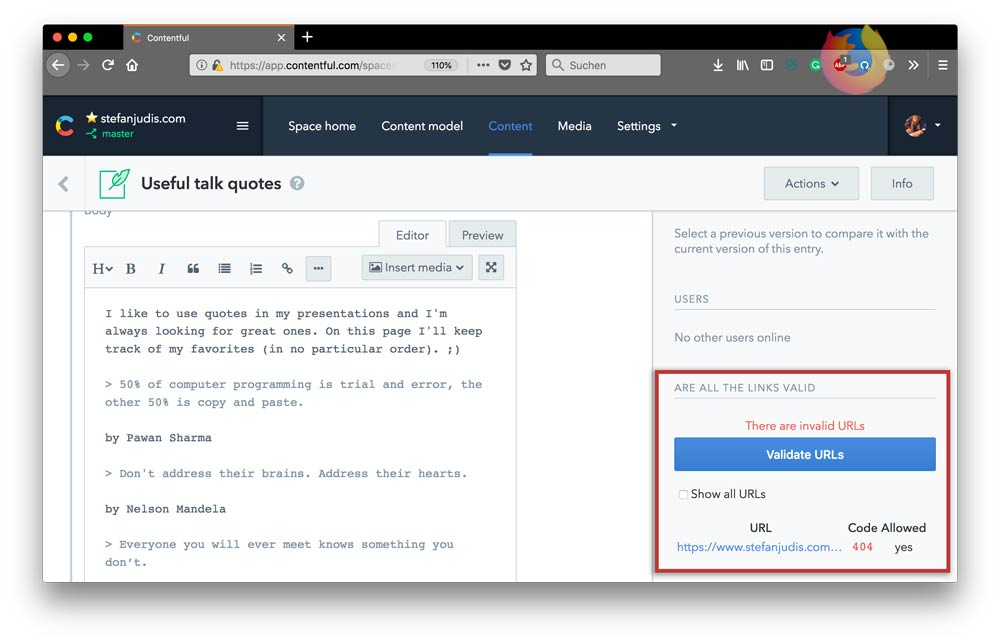

# Contentful URL checker UI extension

A Contentful UI-extension that gets all string values of an entry, gets the included URLs and makes actual requests to see if the URL responds with a 200 status code.

